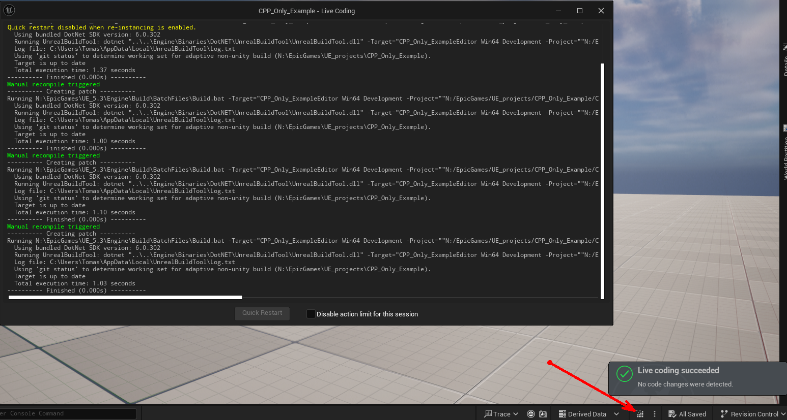

# Poznámky k pokusnému projektu pro UE čistě v C++

## Zdroje
Základ jsem dělal dle těchto tutoriálů na youtube: Unreal Engine 5 Tutorial - C++ 1-4 (Ryan Laley)
[Unreal Engine 5 Tutorial - C++ Part 1: Create a Class](https://www.youtube.com/watch?v=FBpnOuCgHu4&list=PL6lJIEYmhD4_CeSnVzSdxOLVAuzTYf26Z)
[Unreal Engine 5 Tutorial - C++ Part 2: UProperty & UFunction](https://www.youtube.com/watch?v=B9czUTN23SQ&list=PL6lJIEYmhD4_CeSnVzSdxOLVAuzTYf26Z)

## Obecné postřehy/zkušenosti

- Je to možná divné, ale build změn zdrojáků v C++ je vhodné dělat jen přes fci "Live Coding"
  
  přímo v Unreal Engine. Build přímo ve Visual Studio zdá se způsoboval různé konflikty a problémy s buildem, 
  které jsem popsal v kapitole [Nelze otevřít UE projekt, protože prý nejde zkompilovat](#nelze-otevřít-ue-projekt-protože-prý-nejde-zkompilovat). Dokonce se mě stalo 
  i to, že ve VS build selhal (nesmyslně mimo moje změny), ale v UE byl OK a vše fungovalo jak má.

## Problémy s buildem

### Hned po založení projektu to hlásí chyby při kompilaci
``Engine\Source\Programs\AutomationTool\BuildGraph\BgScriptReader.cs(1640,37,1640,42): error CS8604: Possible null reference argument for parameter ‘other’ in ‘void HashSet.UnionWith(IEnumerable other)’.``
``Engine\Source\Programs\AutomationTool\Scripts\CheckForHacks.cs(87,26): error CA2017: Number of parameters supplied in the logging message template do not match the number of named placeholders``
Bohužel v UE 5.3 jsou skutečně tyto dvě chyby, takže pokud chcete mít možnost něco dělat v UE 5.3 v C++ musíte nejprve tyto chyby, přímo v instalaci UE 5.3 opravit viz.:
[Error compiling the Automation Tool after updating Visual Studio today (Unreal 5.3.2)](https://forums.unrealengine.com/t/error-compiling-the-automation-tool-after-updating-visual-studio-today-unreal-5-3-2/1393088)
Takže je potřeba najít instalační složku UE 5.3 a v ní změnit následující v těchto souborech:
**Engine\Source\Programs\AutomationTool\Scripts\CheckForHacks.cs řádek 87 na:**
```cpp 
Logger.LogInformation("Scanning files... [{Arg0}]", FilesToCheck.Count);
```
**Engine\Source\Programs\AutomationTool\BuildGraph\BgScriptReader.cs řádek 1640 na:**
```cpp 
if (users != null)
  	report.NotifyUsers.UnionWith(users);
```
### Nekompatibilita s některými pluginy
Ani oprava kompilace v UE 5.3 ale v našem případě nestačila. Objevila se nekompatibilita s některými pluginy
#### GraphNUnrealPlugin
Expecting to find a type to be declared in a module rules named 'GraphNUnrealPlugin' in UE5Rules, Version=0.0.0.0, Culture=neutral, PublicKeyToken=null.  This type must derive from the 'ModuleRules' type defined by Unreal Build Tool.
Nevím jak to řešit jinak než že jsem tento plugin ze složky **Engine\Plugins** odstranil a tím zmizela i chyba. Dostatečné pro tento testovací projekt, 
ale naprosto blokující pro náš projekt, kde tento plugin využíváme! Co s tím? Napsat autorovi jestli by se na to nepodíval?

### Nelze otevřít UE projekt, protože prý nejde zkompilovat

Stalo se, že fce onValueCalculated(int32 result) byla v UE editoru očividně neaktuální, hlásil totiž, že nemá žádný parametr result což ale 
podle souboru [MyTestActor.h](Source/CPP_Only_Example/MyTestActor.h) nebyla pravda, tam parametr byl. 
Takže jsem dal rebuild ve VS, ale stále nic, tak jsem vymazal složku "Binaries" no a to vedlo k tomu, že při pokusu o otevření projektu v UE 
přes "CPP_Only_Example.uproject" to chtělo zkompilovat zdrojáky v UE, což skončilo strohým zahlášením jakési chyby (ale jaké!?) po chvíli 
prohrabávání složky s projektem jsem to našel tady [\Saved\Logs\CPP_Only_Example.log](Saved/Logs/CPP_Only_Example.log) bylo to plné hlášek typu: 
``error LNK2005: "public: void __cdecl AMyTestActor::onValueCalculatedNative(int)" (?onValueCalculatedNative@AMyTestActor@@QEAAXH@Z) už je definované v MyTestActor.cpp.obj``

> [!IMPORTANT]
> Tenhle soubor jsem našel ve složce: "Intermediate\Build\Win64\x64\UnrealEditor\Development\CPP_Only_Example" takže jsem se rozhodl 
> celou složku "Intermediate\Build" smazat a opětovné otevření "CPP_Only_Example.uproject" a následný build konečně v pohodě!
> 
> **Takže se to celé zhnojilo a tohle je jediný způsob jak to asi opravit.**
